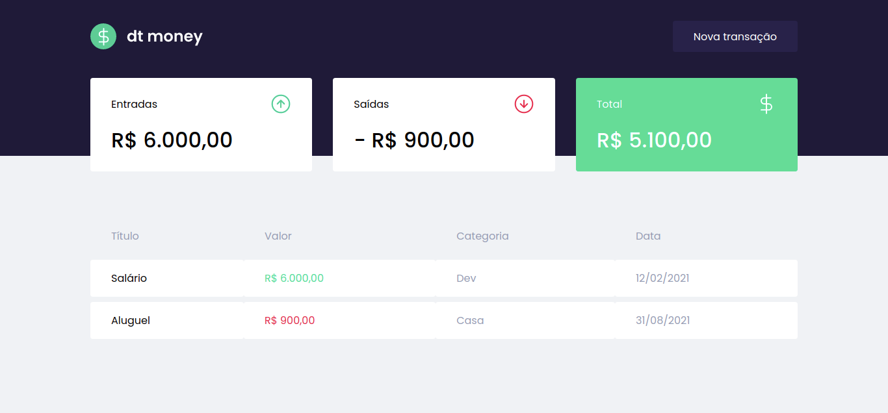

<h1 align="center"><em>DTMONEY</em> - Controll your finances</h1>

This app helps you to have an overview about your finances.

 <a href="#description">Description</a> •
 <a href="#technologies">Technologies</a> • 
 <a href="#author">Author</a>

### Description

Hello everyone!

This project is from Rocketseat's Ignite Bootcamp. I'm currently learning a lot about ReactJS through this bootcamp.

It's a site where you can describe your financial entries and withdrawals so that you can organize your day.

</img>

### Technologies

The following technologies were used in this project:

ReactJS, styled-components, Typescript and MirageJS.

This project helped me consolidate themes like context, props and hooks.

### Author

<a href="https://github.com/victoriacesar" rel="nofollow">
 
  
</a>

Victória César @victoriacesar

<a href="https://github.com/victoriacesar">
  
<a>
